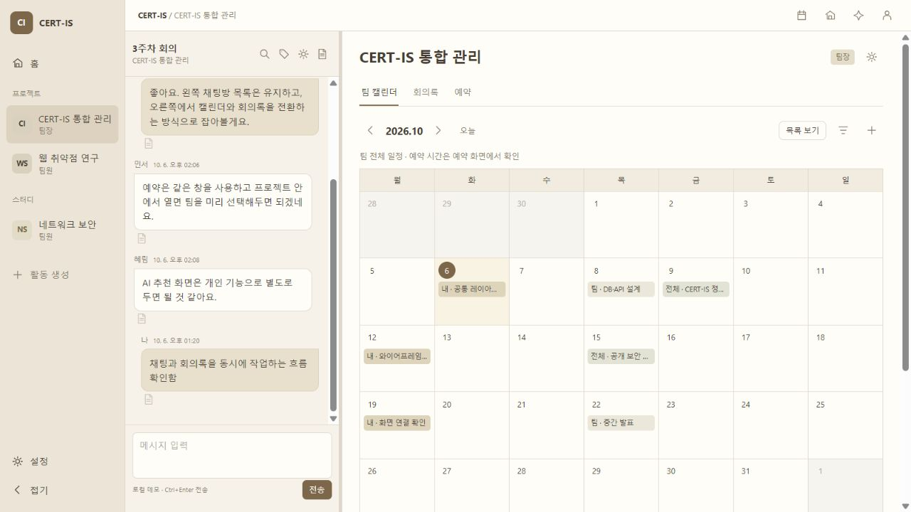

# CERT-IS React 앱

React + TypeScript + Tailwind CSS를 Vite로 실행함. 기존 해시 주소와 브라우저 저장 키를 이어 사용함. 같은 호스트·포트에서 실행하면 이전 시제품의 저장 자료와 사용자별 초안이 유지됨. `localhost`와 `127.0.0.1`은 서로 다른 저장 공간임.

## 실행과 검사

Node.js 22.18 이상, pnpm 11 필요함.

```powershell
cd frontend
pnpm install
pnpm dev
```

http://127.0.0.1:8765/#/dashboard 에서 확인 가능함. 포트가 사용 중이면 기존 서버를 종료해야 함.

```powershell
pnpm check
pnpm test
pnpm build
pnpm preview
```

`preview`는 빌드 결과 확인용임. `dev`와 같은 포트를 사용하므로 동시에 실행하지 않음. 빌드 결과는 `dist/`에 생성됨. 배포 시 이 폴더를 정적 호스팅하면 됨.

## 코드 위치

| 파일 | 역할 |
|---|---|
| src/App.tsx | 해시 주소, 전체 탐색·채팅·메인 레이아웃, 화면 상태 |
| src/model.ts | 타입, 기존 자료 이관, 로컬 저장·권한·예약·문서 버전 검증 |
| src/Chat.tsx | 메시지·읽음·이전 메시지·방 탐색·검색·태그 덮개 |
| src/DocumentPage.tsx | 사용자별 초안, 명시적 저장, 버전 비교·이력·내보내기 |
| src/Pages.tsx | 활동 목록, 캘린더, 예약, 추천 샘플, 설정 |
| src/Dialog.tsx | 활동·구성원·팀장 위임·방·태그·일정·예약 양식 |
| src/ui.tsx / src/styles.css | 공통 입력·아이콘·간단한 Markdown 표시 / Tailwind·베이지 스타일 |
| src/seed.json | 참여·미참여 프로젝트/스터디와 메시지·문서·일정·예약 샘플 |
| checks/model.test.ts | Node 기본 테스트로 운영 규칙 확인 |
| checks/navigation.mjs | 브라우저 탭의 `checkNavigation(tab)`으로 전역 탐색·와플 모달·활동 진입 검사 |

별도 라우터·상태 관리·UI·날짜 입력 라이브러리는 추가하지 않았음. URL은 해시, 입력은 HTML 기본 기능, 화면은 React 훅, 스타일은 Tailwind와 필요한 CSS로 처리함. Markdown은 제목·문단·목록·강조·코드 표시만 지원함.

개인 캘린더의 일정 목록에서 여러 일정을 핀으로 즐겨찾기할 수 있음. 핀한 일정은 날짜 칸에 모두 표시하며, 제목 줄바꿈과 핀 개수에 따라 해당 주의 높이가 늘어남. 핀하지 않은 일정은 기본 두 개 범위에서 표시하고 나머지는 날짜 상세 목록에서 확인함. 사용자별 `calendarPins`를 기존 브라우저 환경설정에 저장하며, 팀 캘린더에는 적용하지 않음.

서버 연결 시 개인 즐겨찾기는 `(user_id, event_id)` 관계로 저장하고 이 두 값의 조합만 중복 방지함. 같은 사용자·날짜에 여러 핀이 가능해야 하므로 날짜별 개수 제한은 두지 않음. 조회·추가·해제 API에서 인증 사용자와 일정 조회 권한을 검증하고, 삭제된 일정의 연결은 정리함. 현재 실제 서버 저장은 미구현임.

예약 시간표는 날짜를 `1(월)`처럼 표시하고 월마다 `2026년 10월` 구분선을 넣음. 09:00~24:00의 30분 구간을 표시하며 예약 막대에는 예약자명을 사용함. 종료 시간으로만 `24:00`을 허용하고 자정을 넘는 예약은 차단함.

## 유지한 흐름

- 사이드바는 홈·달력·예약·AI 추천, 점선 2줄, 프로젝트·스터디 와플 아이콘과 생성 아이콘 순서임. 와플 옆의 최대 320px 팝오버에서 프로젝트·스터디 구역을 얇은 선으로 나누고 아이콘과 이름을 3열로 표시함. 화면 전체를 흐리지 않으며 내용만큼 높이를 사용함. 제목 오른쪽의 돋보기로 검색을 열고, 바로 오른쪽 +로 활동을 생성함. 바깥 클릭·Esc로 닫음. 설정·접기는 하단에 유지함.
- 홈·개인 달력·전역 예약·AI 추천·설정에서는 채팅을 표시하지 않음. 참여 활동 안에서는 해당 활동의 채팅과 메인 스크롤이 독립임. 입력창 123px 고정, 탐색·검색·태그는 메시지를 덮음. 관리 양식은 메인 영역에서 열며 채팅을 계속 사용할 수 있음.
- 팀장은 생성자·위임에 따른 활동별 관계임. 여러 팀의 팀장 겸임 가능함. 임원진은 미참여 활동도 조회하며 대화와 문서 변경 권한은 별도임.
- 활동·구성원·방·태그·일정 관리, 예약 중복 차단·변경·취소 기록, 문서 초안 복원·명시적 저장·버전 비교 유지함.
- 메시지 갱신으로 회의록 편집을 재생성하지 않음. 문서 URL에 방 ID를 유지하여 채팅방 변경이 현재 편집 문서를 바꾸지 않음.

## 검증 기록 · 2026-10-06

타입 검사와 Vite 배포 빌드 성공했음. `pnpm test` 운영 검사 9개 통과했음. 이전 자료·메시지 ID, 활동 생성/위임, 구성원 제외, 예약 간격·취소·최신 스냅샷, 초안 분리·명시적 저장·충돌, 저장 실패 복구, 임원진 일정 범위·미참여 문서 권한 확인함.

브라우저에서 입력창과 메시지 영역이 검색 덮개 전후 각각 123px·489px로 동일함을 확인했음. 초안 작성→보기 전환→채팅 전송→새로고침 후 v1·초안 유지 확인함. 두 사용자 탭에서 메시지 수신 중 편집 포커스 유지, 다른 사용자의 저장 후 비교 창, 초안 유지 선택 후 명시적 저장 확인함. 활동 생성자 팀장→민서 위임, 일정 등록, 예약 충돌→확정→사유 취소, 활동의 실제 구성원만 방 생성 후보로 표시, 태그 그룹 생성, 임원진 전체 목록과 미참여 문서 조회 확인함. 기본 1280px 검증 화면과 실제 319px 미리보기에서 사이드바·독립 영역·관리 양식 접근 확인함. 콘솔 오류·경고 없었음.

현재 앱은 로컬 데모임. 사용자 변경 창과 수신 예시는 검토 도구이며 실제 로그인·전송 기능이 아님. API·인증·DB·WebSocket·Gemini 연결과 여러 PC 동시 예약 보장은 미구현임. 서버 연결 계약은 [기존 FE·API 기록](../cert-is-wireframe/FE_API_연결_계약.md)을 참고하면 됨. 기존의 상세 정책 기본값은 [시제품 README](../cert-is-wireframe/README.md)에 보존했음.



추가 화면 확인: AI 추천의 분야·경험 선택에 따른 결과와 활동 링크 확인함. 편집 중 채팅방을 1주차로 바꿔도 회의록 URL의 room=4와 초안이 유지됐음. 방향키로 채팅 폭 300→310px 변경 확인함. 추가 검증 탭도 콘솔 오류·경고 없었음.
